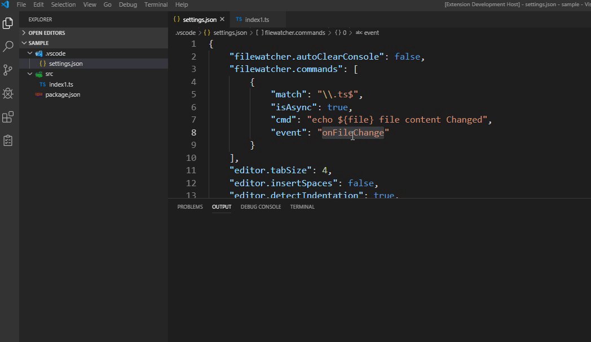
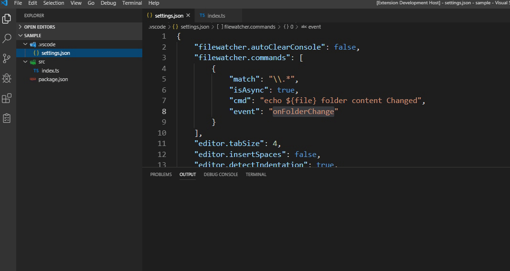

# File & Folder Watcher

This extension allows configuring commands that get run whenever a file is saved (changed, deleted, renamed, created) or folder is changed (deleted, created) in vscode.

## Features
* Following events: onSaveDocument, onFileDelete, onFileRename, onFileCreate, onFolderChange, onFolderDelete and onFolderCreate:
    * **onFileChange** - allows you to track changes to the contents of an existing file when you save the file
    * **onFileChangeImmediate** - allows to track changes to the contents of an existing file
    * **onFileRename** - allows to track the renaming of file(s)
    * **onFileCreate** - allows to track the creation of file(s)
    * **onFolderChange** - allows to track the modification of files
    * **onFolderDelete** - allows to track the deletion of files
    * **onFolderCreate** - allows to track the addition of files
* **case insensitive** workspace root folder
* Configure multiple commands that run when the event happened
* Regex pattern matching for files that trigger commands running
* Sync and async support

## Configuration
Add "filewatcher" configuration to user or workspace settings.
* "shell" - (optional) common shell path to be used with child_process.exec options that runs commands.
* "autoClearConsole" - (optional) clear VSCode output console every time commands run. Defaults to false.
* "isClearStatusBar" - (optional) returns the status bar to its normal position (after receiving a 'Success' or 'Error' status) after a some time. commands.
* "statusBarDelay" - (optional) the time after which the status returns to normal. Only works if isClearStatusBar === true. Default is 5000ms
* "isSyncRunEvents" - (optional) launches event handlers of the same name with the appropriate pattern 'match' or 'notMatch' (e.g. onFileChange and onFolderChange) in synchronous or asynchronous mode.
* "successTextColor" - (optional) color of successful completion of the process in the status bar.
* "runTextColor" - (optional) color during the execution of the process in the status bar.
* "commands" - array of commands that will be run whenever a file is saved.
  * "shell" - (optional) unique shell to execute the command with (gets passed to child_process.exec as an options arg. e.g. child_process(cmd, { shell }).
  * "match" - a regex for matching which files to run commands on.
  * "notMatch" - a regex for matching files *not* to run commands on.
  > NOTE Since this is a Regex, and also in a JSON string backslashes have to be double escaped such as when targetting folders. e.g. "match": "some\\\\folder\\\\.*"
  * "cmd" - command to run. Can include parameters that will be replaced at runtime (see Placeholder Tokens section below).
  * "vscodeTask" - Name of a VS Code task defined in tasks.json or commands to execute. Only works if cmd value does not exist. Must be a string (e.g. command id) or array of strings (e.g. ['workbench.action.tasks.runTask', 'some-task-name'] and etc.)
  > NOTE Since there is no universal listener for the all execution of the vscode commands and tasks, which will wait for the end of the process execution. The logs in the output and the status bar will only show whether the command was run or not.
  * "isAsync" (optional) - defaults to false. If true, next command will be run before this one finishes.

## Placeholder Tokens
Commands support placeholders similar to tasks.json.

* ${workspaceRoot}: **case insensitive** workspace root folder
* ${workspaceRelativeDir}: **case insensitive** is the file relative path to the workspaceRoot
* ${currentWorkspace}: **case insensitive** current working folder
* ${currentRelativeWorkspace}: **case insensitive** file relative path to the current working folder
* ${file}: path of tracking file
* ${fileOld}: path of tracking file when renaming
* ${fileBasename}: saved file's basename
* ${fileDirname}: directory name of tracking file
* ${fileExtname}: extension (including .) of tracking file
* ${fileBasenameNoExt}: tracking file's basename without extension

Samples
=========

**File content** change tracking example.
    Configuration in \.vscode\settings.json
	
	{
		"filewatcher.commands": [
			{
				"match": "\\.ts*",
				"isAsync": true,
				"cmd": "echo '${file} file content Changed'",
				"event": "onFileChange"
			}		
		]
	}
	

**Folder content** change tracking example.
    Configuration in \.vscode\settings.json

	{
    	"filewatcher.commands": [
			{
				"match": "\\.*",
				"isAsync": true,
				"cmd": "echo '${file} folder content Changed'",
				"event": "onFolderChange"
			}		
		]
	}

